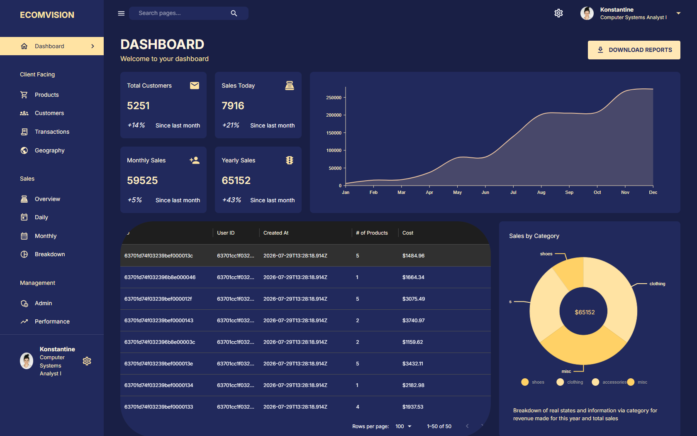
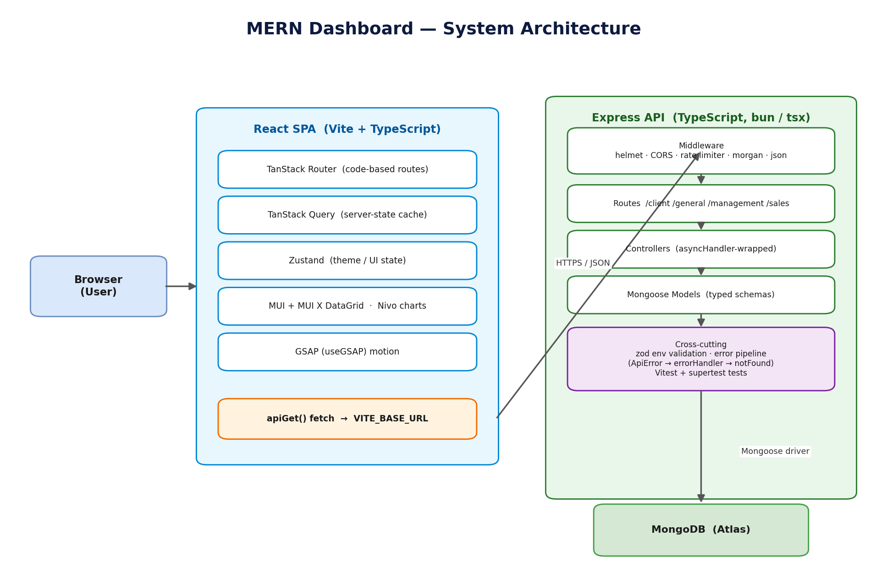

<a id="readme-top"></a>

<!-- BADGES (reference-style; definitions at the bottom of the file) -->
[![Contributors][contributors-shield]][contributors-url]
[![Forks][forks-shield]][forks-url]
[![Stargazers][stars-shield]][stars-url]
[![Issues][issues-shield]][issues-url]
[![MIT License][license-shield]][license-url]
[![LinkedIn][linkedin-shield]][linkedin-url]

<!-- HEADER (text title + tagline; logo lives at the END) -->
<div align="center">
  <h1>EcomVision — MERN Admin Dashboard</h1>
  <p><b>An authenticated, role-based e-commerce analytics dashboard: a React + TypeScript SPA backed by a Bun-native, typed, tested Express API.</b></p>
  <p>
    <a href="https://github.com/omunite215/Project_MERN-Dashboard/issues/new?labels=bug">Report Bug</a>
    &nbsp;·&nbsp;
    <a href="https://github.com/omunite215/Project_MERN-Dashboard/issues/new?labels=enhancement">Request Feature</a>
  </p>
</div>

<!-- TABLE OF CONTENTS -->
<details>
  <summary>Table of Contents</summary>
  <ol>
    <li><a href="#about-the-project">About The Project</a>
      <ul><li><a href="#built-with">Built With</a></li></ul>
    </li>
    <li><a href="#features">Features</a></li>
    <li><a href="#architecture">Architecture</a></li>
    <li><a href="#getting-started">Getting Started</a>
      <ul>
        <li><a href="#prerequisites">Prerequisites</a></li>
        <li><a href="#installation">Installation</a></li>
      </ul>
    </li>
    <li><a href="#usage">Usage</a></li>
    <li><a href="#testing">Testing</a></li>
    <li><a href="#deployment">Deployment</a></li>
    <li><a href="#roadmap">Roadmap</a></li>
    <li><a href="#contributing">Contributing</a></li>
    <li><a href="#license">License</a></li>
    <li><a href="#contact">Contact</a></li>
    <li><a href="#acknowledgments">Acknowledgments</a></li>
  </ol>
</details>

## About The Project

<p align="center"></p>

EcomVision is an admin dashboard for a fictional e-commerce business. It visualises sales, products, customers, transactions and geography, adds tiered role-based access control, and turns Products into a full create/edit/delete workflow. The front end is a single-page React app built with Vite and TypeScript; the back end is a typed Express API that runs on the Bun runtime over MongoDB.

The project was modernised end to end. The client moved from Create React App to Vite with Zustand for UI state and the TanStack ecosystem (Query for data, Router for routing, Form for forms). The server was migrated to TypeScript on the Bun runtime with Typegoose models, zod-validated configuration and requests, a global error pipeline, and an automated test suite. On top of that foundation sits JWT authentication with a short-lived access token in memory and a refresh token in an httpOnly cookie, role-based authorization, and a Products CRUD exemplar validated on both the client and the server.

<p align="right">(<a href="#readme-top">back to top</a>)</p>

### Built With

[![React][React-badge]][React-url]
[![TypeScript][TS-badge]][TS-url]
[![Vite][Vite-badge]][Vite-url]
[![MUI][MUI-badge]][MUI-url]
[![TanStack Query][TQ-badge]][TQ-url]
[![TanStack Router][TR-badge]][TR-url]
[![Zustand][Zustand-badge]][Zustand-url]
[![Zod][zod-badge]][zod-url]
[![GSAP][GSAP-badge]][GSAP-url]

[![Bun][Bun-badge]][Bun-url]
[![Express][Express-badge]][Express-url]
[![MongoDB][MongoDB-badge]][MongoDB-url]
[![Mongoose][Mongoose-badge]][Mongoose-url]
[![JWT][JWT-badge]][JWT-url]
[![Vitest][Vitest-badge]][Vitest-url]
[![oxlint][oxlint-badge]][oxlint-url]

<p align="right">(<a href="#readme-top">back to top</a>)</p>

## Features

- **Authentication** — register and login with a short-lived JWT access token held in memory and a long-lived refresh token in an httpOnly, secure, sameSite cookie. Sessions survive reloads via a silent refresh, and a `tokenVersion` allows server-side revocation.
- **Role-based access control** — any authenticated user can view; `admin` and `superadmin` can mutate; `superadmin` is reserved for user management. Mutation controls are hidden in the UI and enforced by middleware on the API.
- **Products CRUD** — role-gated add / edit / delete with a zod-validated form (TanStack Form) that mirrors the server schema, optimistic query invalidation, and confirm-before-delete.
- **Overview dashboard** — KPI stat boxes, a sales overview line chart, a sales-by-category breakdown, a recent-transactions grid, and a one-click **CSV report export**.
- **Customers & Admins** — data grids backed by MUI X DataGrid with column menu, density, export and quick filtering.
- **Transactions** — server-side pagination, sorting and search.
- **Geography** — a Nivo choropleth of users by country.
- **Sales views** — Overview (sales/units toggle), Daily (with a date-range filter) and Monthly line charts.
- **Performance** — per-user affiliate sales, with a graceful fallback to the user's own transactions.
- **Quick navigation & settings** — a header search with live page suggestions, plus a settings menu showing the signed-in account and a dark / light theme toggle.
- **Typed, validated API** — Express 5 on Bun with Typegoose models, a reusable zod `validate` middleware on every route, a global error handler, 404 handling, helmet, a CORS allow-list, and per-route rate limiting.
- **Tested back end** — `bun test` (bun:test) with supertest against an in-memory MongoDB; the client is tested with Vitest and React Testing Library.

<p align="right">(<a href="#readme-top">back to top</a>)</p>

## Architecture

<p align="center"></p>

The browser loads the React SPA (Vite). TanStack Router drives navigation and guards the dashboard, TanStack Query manages server state through an auth-aware `apiFetch` wrapper that attaches the access token and silently refreshes on a 401, and Zustand holds the in-memory auth and theme state. Requests hit the Express API, which layers helmet, a CORS allow-list, rate limiting and morgan, then `authenticate` / `authorize` middleware and a zod `validate` step before routing to thin controllers over typed Typegoose/Mongoose models on MongoDB. Passwords are hashed with argon2id (`Bun.password`), JWTs are signed with `jose`, configuration is validated with zod at startup, and errors flow through a single pipeline. The editable source of this diagram lives at [`client/public/architecture.drawio`](client/public/architecture.drawio).

<p align="right">(<a href="#readme-top">back to top</a>)</p>

## Getting Started

### Prerequisites

- [Bun](https://bun.sh) `>= 1.3`
- A MongoDB connection string (local or [MongoDB Atlas](https://www.mongodb.com/atlas))

### Installation

1. Clone the repository
   ```bash
   git clone https://github.com/omunite215/Project_MERN-Dashboard.git
   cd Project_MERN-Dashboard
   ```
2. Start the API
   ```bash
   cd server
   bun install
   cp .env.example .env        # set MONGODB_URL, JWT_ACCESS_SECRET, JWT_REFRESH_SECRET
   bun run seed                # first run only — loads the sample data
   bun run hash-passwords      # first run only — argon2-hashes the seeded passwords
   bun run dev                 # http://localhost:5001
   ```
3. Start the client (in a second terminal)
   ```bash
   cd client
   bun install                 # set VITE_BASE_URL=http://localhost:5001 in client/.env
   bun run dev                 # http://localhost:3000
   ```

Once the passwords are hashed you can sign in with the seeded superadmin — `kranstead0@narod.ru` / `omMDCh` — or register a new account (new accounts are always created with the `user` role).

<p align="right">(<a href="#readme-top">back to top</a>)</p>

## Usage

Open `http://localhost:3000`. You are routed to `/login`; sign in (or register) and land on the dashboard. From there:

- Browse the sidebar — Dashboard, Products, Customers, Transactions, Geography, Overview, Daily, Monthly, Breakdown, Admin and Performance — or jump to a page from the header search.
- On **Products**, an `admin` / `superadmin` account sees Add / Edit / Delete controls; a `user` account sees the catalogue read-only (and mutation requests are rejected with `403`).
- Use **Download Reports** on the dashboard to export the recent transactions as CSV.
- Use the settings gear to see the signed-in account and toggle dark / light mode.

Configuration is validated at startup. The client reads `VITE_BASE_URL` (see `client/.env`); the server reads `MONGODB_URL`, `PORT` (default `5001`), `CLIENT_ORIGIN` (comma-separated allow-list), `JWT_ACCESS_SECRET`, `JWT_REFRESH_SECRET`, the token TTLs, and the cookie / proxy settings (see `server/.env.example`).

<p align="right">(<a href="#readme-top">back to top</a>)</p>

## Testing

```bash
cd server
bun test            # bun:test + supertest (in-memory MongoDB)
bun run typecheck   # tsc --noEmit
bun run lint        # oxlint
```

```bash
cd client
bun run test        # Vitest + React Testing Library
bun run typecheck   # tsc --noEmit
bun run lint        # oxlint
bun run build       # production build
```

<p align="right">(<a href="#readme-top">back to top</a>)</p>

## Deployment

The API is a plain HTTP server, so the same build runs anywhere. A [`server/Dockerfile`](server/Dockerfile) based on `oven/bun` produces a single container image (Bun runs the TypeScript directly — no build step). The intended near-zero-cost target is AWS Lambda via the [AWS Lambda Web Adapter](https://github.com/awslabs/aws-lambda-web-adapter) on that image, with MongoDB Atlas M0 for data and S3 + CloudFront for the static front end. The same image also runs on App Runner, ECS, EC2 or any container host. Cookies and CORS are driven entirely by environment variables, so the identical build serves same-site or cross-site by configuration alone.

<p align="right">(<a href="#readme-top">back to top</a>)</p>

## Roadmap

- [ ] User-management UI for `superadmin`
- [ ] Customers & Transactions CRUD (replicating the Products exemplar)
- [ ] AWS deployment (Lambda + Atlas + CloudFront) and infrastructure-as-code
- [ ] CI pipeline (typecheck, lint and tests on push)
- [ ] Expanded front-end component tests
- [ ] AI-assisted insights

See the [open issues](https://github.com/omunite215/Project_MERN-Dashboard/issues) for a full list of proposed features and known issues.

<p align="right">(<a href="#readme-top">back to top</a>)</p>

## Contributing

Contributions make the open-source community a great place to learn and build. Any contributions you make are **greatly appreciated**.

1. Fork the project
2. Create your feature branch (`git checkout -b feature/amazing-feature`)
3. Commit your changes (`git commit -m 'Add amazing feature'`)
4. Push to the branch (`git push origin feature/amazing-feature`)
5. Open a pull request

<p align="right">(<a href="#readme-top">back to top</a>)</p>

## License

Distributed under the MIT License — Copyright © 2026 Om Patel. See [`LICENSE`](LICENSE) for the full text.

<p align="right">(<a href="#readme-top">back to top</a>)</p>

## Contact

Om Patel

[![GitHub][github-shield]][github-url]
[![LinkedIn][linkedin-shield]][linkedin-url]
[![Instagram][instagram-shield]][instagram-url]
[![Portfolio][portfolio-shield]][portfolio-url]
[![Email][email-shield]][email-url]

Project link: [https://github.com/omunite215/Project_MERN-Dashboard](https://github.com/omunite215/Project_MERN-Dashboard)

<p align="right">(<a href="#readme-top">back to top</a>)</p>

## Acknowledgments

- [Best README Template](https://github.com/othneildrew/Best-README-Template)
- [Shields.io](https://shields.io)
- [Simple Icons](https://simpleicons.org) for tech-stack logos

<p align="right">(<a href="#readme-top">back to top</a>)</p>

<!-- LOGO AT THE END (sign-off) -->
<div align="center">
  <br />
  
  <p><sub>Built by Om Patel</sub></p>
</div>

<!--
================================================================================
  REFERENCE-STYLE LINK & BADGE DEFINITIONS
================================================================================
-->
[contributors-shield]: https://img.shields.io/github/contributors/omunite215/Project_MERN-Dashboard.svg?style=for-the-badge
[contributors-url]: https://github.com/omunite215/Project_MERN-Dashboard/graphs/contributors
[forks-shield]: https://img.shields.io/github/forks/omunite215/Project_MERN-Dashboard.svg?style=for-the-badge
[forks-url]: https://github.com/omunite215/Project_MERN-Dashboard/network/members
[stars-shield]: https://img.shields.io/github/stars/omunite215/Project_MERN-Dashboard.svg?style=for-the-badge
[stars-url]: https://github.com/omunite215/Project_MERN-Dashboard/stargazers
[issues-shield]: https://img.shields.io/github/issues/omunite215/Project_MERN-Dashboard.svg?style=for-the-badge
[issues-url]: https://github.com/omunite215/Project_MERN-Dashboard/issues
[license-shield]: https://img.shields.io/github/license/omunite215/Project_MERN-Dashboard.svg?style=for-the-badge
[license-url]: https://github.com/omunite215/Project_MERN-Dashboard/blob/main/LICENSE

[github-shield]: https://img.shields.io/badge/GitHub-181717?style=for-the-badge&logo=github&logoColor=white
[github-url]: https://github.com/omunite215
[linkedin-shield]: https://img.shields.io/badge/LinkedIn-0A66C2?style=for-the-badge&logo=linkedin&logoColor=white
[linkedin-url]: https://www.linkedin.com/in/om-patel-ai
[instagram-shield]: https://img.shields.io/badge/Instagram-E4405F?style=for-the-badge&logo=instagram&logoColor=white
[instagram-url]: https://www.instagram.com/_21omp/
[portfolio-shield]: https://img.shields.io/badge/Portfolio-000000?style=for-the-badge&logo=vercel&logoColor=white
[portfolio-url]: https://portfolio-jade-gamma-13.vercel.app
[email-shield]: https://img.shields.io/badge/Email-EA4335?style=for-the-badge&logo=gmail&logoColor=white
[email-url]: mailto:omunite21@gmail.com

[React-badge]: https://img.shields.io/badge/React-20232A?style=for-the-badge&logo=react&logoColor=61DAFB
[React-url]: https://react.dev
[TS-badge]: https://img.shields.io/badge/TypeScript-3178C6?style=for-the-badge&logo=typescript&logoColor=white
[TS-url]: https://www.typescriptlang.org
[Vite-badge]: https://img.shields.io/badge/Vite-646CFF?style=for-the-badge&logo=vite&logoColor=white
[Vite-url]: https://vite.dev
[MUI-badge]: https://img.shields.io/badge/MUI-007FFF?style=for-the-badge&logo=mui&logoColor=white
[MUI-url]: https://mui.com
[TQ-badge]: https://img.shields.io/badge/TanStack%20Query-FF4154?style=for-the-badge&logo=reactquery&logoColor=white
[TQ-url]: https://tanstack.com/query
[TR-badge]: https://img.shields.io/badge/TanStack%20Router-EF4444?style=for-the-badge&logo=react&logoColor=white
[TR-url]: https://tanstack.com/router
[Zustand-badge]: https://img.shields.io/badge/Zustand-2D3748?style=for-the-badge&logo=react&logoColor=white
[Zustand-url]: https://zustand-demo.pmnd.rs
[zod-badge]: https://img.shields.io/badge/Zod-3E67B1?style=for-the-badge&logo=zod&logoColor=white
[zod-url]: https://zod.dev
[GSAP-badge]: https://img.shields.io/badge/GSAP-88CE02?style=for-the-badge&logo=greensock&logoColor=white
[GSAP-url]: https://gsap.com
[Bun-badge]: https://img.shields.io/badge/Bun-000000?style=for-the-badge&logo=bun&logoColor=white
[Bun-url]: https://bun.sh
[Express-badge]: https://img.shields.io/badge/Express-000000?style=for-the-badge&logo=express&logoColor=white
[Express-url]: https://expressjs.com
[MongoDB-badge]: https://img.shields.io/badge/MongoDB-47A248?style=for-the-badge&logo=mongodb&logoColor=white
[MongoDB-url]: https://www.mongodb.com
[Mongoose-badge]: https://img.shields.io/badge/Mongoose-880000?style=for-the-badge&logo=mongoose&logoColor=white
[Mongoose-url]: https://mongoosejs.com
[JWT-badge]: https://img.shields.io/badge/JWT-000000?style=for-the-badge&logo=jsonwebtokens&logoColor=white
[JWT-url]: https://jwt.io
[Vitest-badge]: https://img.shields.io/badge/Vitest-6E9F18?style=for-the-badge&logo=vitest&logoColor=white
[Vitest-url]: https://vitest.dev
[oxlint-badge]: https://img.shields.io/badge/oxlint-1B2A4A?style=for-the-badge&logo=oxc&logoColor=white
[oxlint-url]: https://oxc.rs
